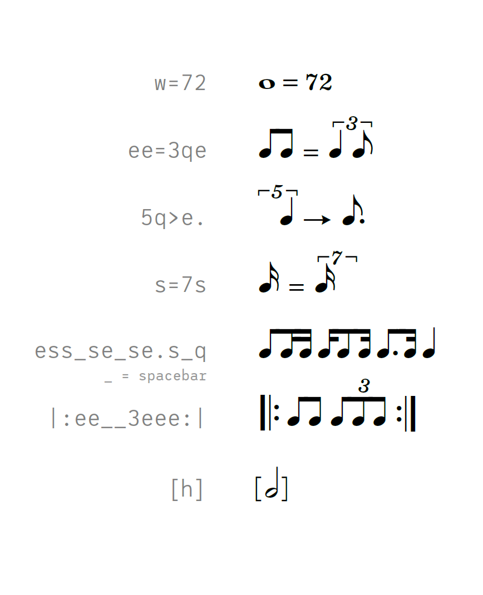

# Metrico
Metrico is a font that allows to easily create metronome marks, metric modulations and swing indications for music notation.

<!--  -->

<!--  -->

### Recent changes  
- Initial commit, rather a proof of concept than a finished font. Metronome marks, basic metric modulations (including single note values in tuplets) and a few swing indications work.

### Compatibility
Metrico makes use of combined OpenType features in a somewhat unorthodox way. Theoretically the font _should_ work in any modern application that supports the LIGA, CALT and KERN features.

**Dorico:** Metrico works perfectly with Dorico on Windows.  
Due to [a bug in the Qt framework](https://bugreports.qt.io/browse/QTBUG-69803) that Dorico is built upon the font does only partly work in Dorico on Mac. Basic figures should work, everything that involves vertical placement of tuplet numbers will currently not work.

**Finale:** Finale’s OpenType support is frustratingly erratic. There’s no guarantee that your particular metric equation will work as expected...

**Sibelius:** Not tested. I expect Metrico to work fine with Sibelius 2018.11 or greater.

_Metrico is licensed under the SIL Open Font License. That means that it is free to use.  
Developing fonts does take time and effort though. If you find the font useful, please consider supporting me with a donation via [paypal.](https://paypal.me/floriankretlow)_
