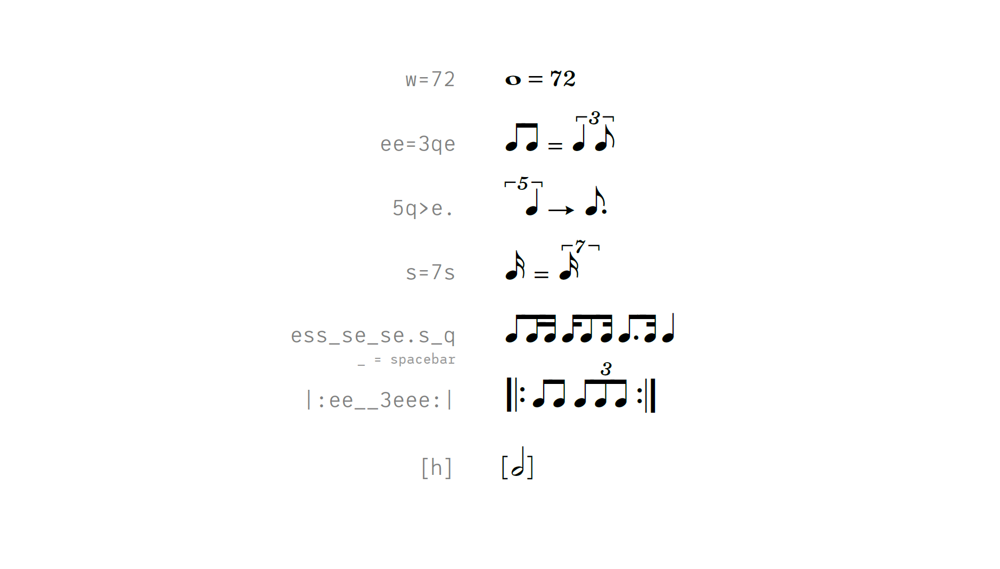

# Metrico
Metrico is a font that allows to easily create metronome marks, metric modulations and swing indications for music notation.

[Changelog](docs/changelog.md)  
[Compatibility notes](docs/compatibility.md)

Metrico is licensed under the SIL Open Font License. However, developing fonts takes considerable time and effort, so here’s an appeal to your fairness:  
If you use this font regularly for commercial work or if you want to sell a derivative of this font (on its own or as part of a larger work or collection), please consider supporting me with a donation [via paypal.](https://paypal.me/floriankretlow)